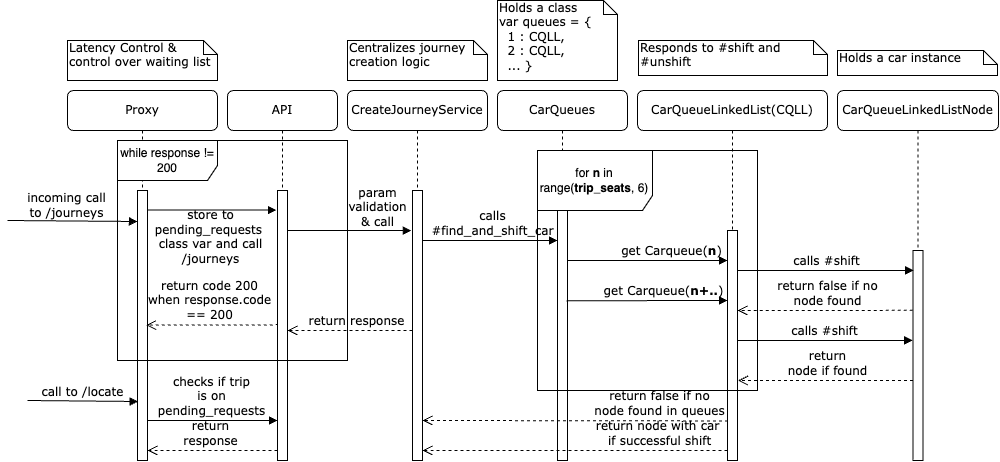

## My solution to Cabify's Car Pooling challenge **Revisited**.

I took this challenge in an interview process with Cabify. The
challenge imposes the ability to somehow manage
connections(keep people connected to a server)
and still make peak capacity. And be able to report who is
holding connections. Using in-memory storage. Which leads to:

b.being able to manage, hold and account for pending connections.

a.using shared thread-safe variables variables for storage.

b.doing atomic operations in the least possible complexity.

In Ruby, this is particularly interesting for me enough to keep
this project alive and find a working solution.

## 1. Getting the app to run
### 1.1. Running the project
```
docker-compose up
```
The app should be available on port 9091 at localhost.

### 1.2. Running the test suite
With the project running, do:
```
docker-compose exec api rspec spec
```

### 1.3. Monitoring
I have added elastic-apm to the project to allow trace
monitoring. You can access Kibana to see the traces on
port 5601 on localhost.

## 2. Design attempts considerations

This project went through 3 designs(which you can find on
the older commits) until this one. This readme covers **only**
the latest(and final) design. Overall the three design schemes
were:

(i)one more complex and using array queues - which Cabify said no to.

It performed connections management (holds connection until a trip is found)
at the application level. The solution is **ok**, although it didn't perform
well al(it is documented on `Reamde_Delivery.md` and at the 66c2487 commit,

(ii)one simpler orchestrating Ruby threads by:

a. Requests post messages including a sleeping thread instance to
a Thread Pool Executor(concurrent-ruby) class.

b. The Thread pool block finds a car and posts to a Thread-safe
notifications variable and awake the Thread. We make
it available for Global Interpreter Lock(GIL) scheduling.

c. As soon as it runs, the thread returns result

This design didn't made it better than a failed POC. Look up
[Thread pool Execution](https://ruby-concurrency.github.io/concurrent-ruby/master/Concurrent/ThreadPoolExecutor.html)
and [Stopping Ruby Threads](https://ruby-doc.org/core-2.5.0/Thread.html#method-c-stop).

(iii) This design, which relies on (a) keeping low latency and
(b) using a Puma & Sinatra proxy to manage connections and
separate business logic from connection management. It is detailed
on **Item 5**.

## 3. Latency Design Calculations
```
latency = nrequests / time_range
```

The requirement is for the app to work with 100k ~ 500k cars.
We assume the app generates sufficient trips
somewhere around that same order of magnitude.

> ncars = ntrips = nrequests = 200_000

Assuming the design number of requests to be solved in
say, **5 minutes:**
```
200_000 / (60*5) = 666RPS
```
This is a **very high** value. In a quick sensitivity analysis, this
is somewhere around double the Requests per Second
(RPS) of the largest payment processing service in Latin America
until now...during a Black Friday... processing in more than a
dozen countries with several fleets of instances per country, so...

We probably won't get there...
Hence it was decided that at least 350 TPS **should** be way
more than satisfactory to be processed by a single process.

Finally, the design latency should be in ms:
```
350 TPS = 1000 ms / max_design_latency
max_design_latency = 2.86 ms
```

## 4. Tooling basics
This Car Pooling API solution is built in Ruby. It uses Sinatra as
API gateway, delegating requests to Ruby classes.

The application is served using Puma. Storage is made in-memory
using Thread-safe class variables.

## 5. Serving cars
### Final Design



Customers hit the proxy in order to create Journeys. The Proxy
stores context and calls the API, which serves cars upon request. In case a car is not available it returns a 404 status. The Proxy will attempt
to find a car every two seconds and will respond accordingly
as soon as one is found.

### Older designs

The first design for the app failed mainly due to excessive
complexity around the connection lock and release, which got
overall latency incompatible with the challenge goals(although
a non-trivial and quite sophisticated solution).

The second solution basically clogged the Ruby process, leading
to crashes due to the excessive context switching when multiple
clients were hanging. Also nice, but too complicated and not
as effective.

## 6. The rationale behind the tooling/solution
There are *THREE* key points:

1. Manipulating data structures in such a way that we always have
   O(1) operations(i.e.: no transversion).

We store cars on hash maps where the keys represent available seats and values are Linked Lists are used as queues(smaller complexity on shift and unshift is leveraged).

To find available cars we iterate through the range
of seats that could serve a trip and find cars from the correspondent LL's, resulting in 6 attempts in the worst case, which keeps the whole operation O(1).

2. Separating the business logic from connection management
   (already detailed in item 2).

3. Thread Safety: Using Ruby concurrent-ruby Thread-safe variables
   & atomic transactions using Mutual Exclusion(Mutex) locks.

#### Additional Notes
1. Ruby concurrent computing interleaves code execution,
   leading to hard-to-track bugs and other known issues when there
   are too many open or hanging contexts.

2. I believe that simpler and more effective solutions could be
   designed by using languages better suited for (i)inter-process
   communication, (ii)parallelism, and (iii)multi-core computing,
   such as Go, Elixir, or Scala.

3. In this solution we beat the requirements using an
   architectural design rather than language features.

4. A real environment on an API has many other layers that
   are already optimized somehow for communication. Which
   makes things unbelievably easier.

## 7. How did I achieve a large number of cars/waiting groups?
Basically low latency by keeping all operations O(1) and
separating connection management from the app business logic.

This way we:
```
(i)  Allow peak time loads to be properly handled & overall low-latency calls
(ii) Allow connection handling to be done separately
without implementing additional threading logic to the Sinatra on the API.
```

Maximum capacity testing was done using Apache Bench. We managed
to keep request latency below 2 ms on average. We have some non
2XX responses due to exhaustion of connection capability by Puma.
```
ab -p ./test_payload.txt -T application/json -c 12 -n 100000 -v 1 -l http://127.0.0.1:9091/journey
with env var
PERFORMANCE_TESTING=true on docker-compose.yml
```

```
Server Software:        
Server Hostname:        127.0.0.1
Server Port:            9091

Document Path:          /journey
Document Length:        Variable

Concurrency Level:      12
Time taken for tests:   386.119 seconds
Complete requests:      200000
Failed requests:        0
Non-2xx responses:      717
Total transferred:      34407150 bytes
Total body sent:        32200000
HTML transferred:       510 bytes
Requests per second:    517.97 [#/sec] (mean)
Time per request:       23.167 [ms] (mean)
Time per request:       1.931 [ms] (mean, across all concurrent requests)
Transfer rate:          87.02 [Kbytes/sec] received
                        81.44 kb/s sent
                        168.46 kb/s total

Connection Times (ms)
              min  mean[+/-sd] median   max
Connect:        0   11 300.0      0   11023
Processing:     1   12  19.1     10     387
Waiting:        1   12  19.0      9     387
Total:          1   23 300.9     10   11246
```

Using the proxy we get a similar result, not affecting the overall
performance. The ab benchmark command is the same from above,
but shooting to port 9091 instead.
```
Server Software:        
Server Hostname:        127.0.0.1
Server Port:            9091

Document Path:          /journey
Document Length:        Variable

Concurrency Level:      12
Time taken for tests:   211.736 seconds
Complete requests:      100000
Failed requests:        0
Total transferred:      17200000 bytes
Total body sent:        16100000
HTML transferred:       0 bytes
Requests per second:    472.29 [#/sec] (mean)
Time per request:       25.408 [ms] (mean)
Time per request:       2.117 [ms] (mean, across all concurrent requests)
Transfer rate:          79.33 [Kbytes/sec] received
                        74.26 kb/s sent
                        153.59 kb/s total

Connection Times (ms)
              min  mean[+/-sd] median   max
Connect:        0    1  24.5      0    1002
Processing:     3   24  17.0     22    2213
Waiting:        3   24  16.9     21    2213
Total:          3   25  30.2     22    2213

Percentage of the requests served within a certain time (ms)
  50%     22
  66%     24
  75%     26
  80%     27
  90%     32
  95%     37
  98%     65
  99%    123
 100%   2213 (longest request)

```